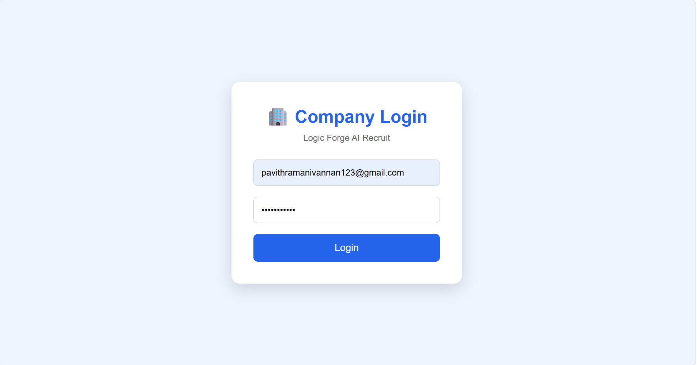
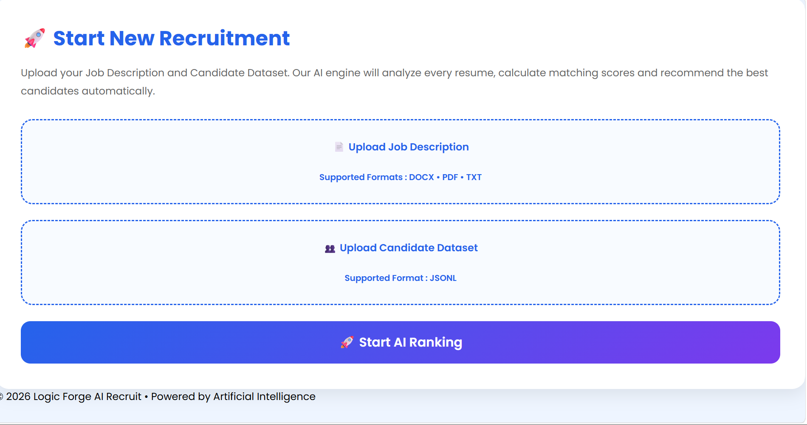
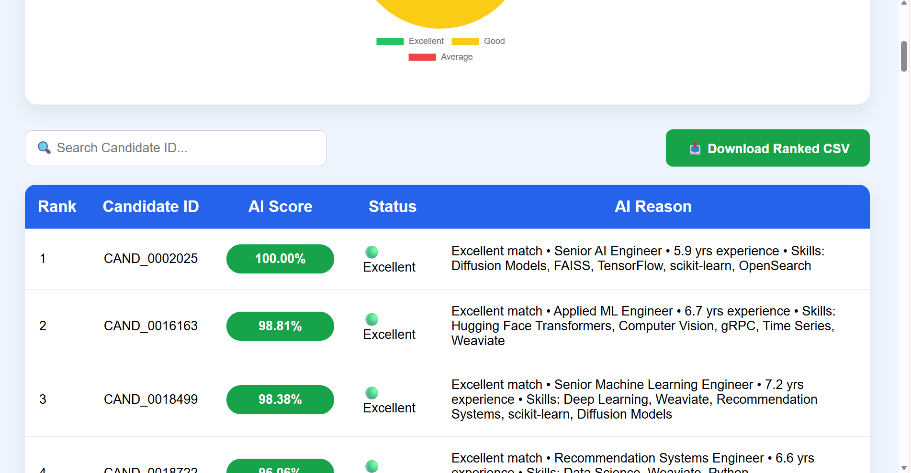

# 🚀 Logic Forge AI Recruit

> **An AI-Powered Intelligent Candidate Ranking Platform**

Logic Forge AI Recruit is an AI-based recruitment platform that automates candidate screening and ranking by analyzing resumes against a given Job Description. The system helps recruiters identify the most suitable candidates quickly, accurately, and efficiently using intelligent ranking algorithms.

---

## 📌 Project Overview

Traditional recruitment involves manually reviewing hundreds or even thousands of resumes, which is time-consuming and prone to human bias.

**Logic Forge AI Recruit** simplifies this process by:

- Parsing candidate resumes
- Comparing candidate skills with job requirements
- Generating AI-based suitability scores
- Ranking candidates automatically
- Providing recruiters with an interactive dashboard and downloadable results

---

## ✨ Features

### 🔐 Recruiter Authentication
- Professional recruiter login interface
- Secure company portal

### 📊 Recruiter Dashboard
- Modern AI recruitment dashboard
- Candidate statistics
- Job upload interface
- Interactive UI

### 📄 Job Description Processing
- Upload Job Description (.txt / .docx)
- Automatic text extraction
- AI-ready preprocessing

### 👥 Candidate Dataset Processing
- Upload Candidate Dataset (.jsonl)
- Parse structured candidate information
- Extract profiles, skills, education, experience and languages

### 🤖 AI Candidate Ranking
- Intelligent resume analysis
- Skill matching
- Candidate scoring
- AI-generated recommendations
- Automatic ranking

### 📈 Results Dashboard
- AI Score
- Candidate ranking
- Candidate details popup
- Interactive charts
- Statistics
- Search functionality

### 📥 Export Results
- Download ranked candidates as CSV
- Easy recruiter access

---

# 📸 Application Screenshots

## 🔐 Company Login



---

## 📊 Recruiter Dashboard



---

## 🤖 AI Ranking Results



---


# 🏗️ System Workflow

```text
Recruiter Login
        │
        ▼
Recruiter Dashboard
        │
        ▼
Upload Job Description
        │
        ▼
Upload Candidate Dataset
        │
        ▼
Resume Parsing
        │
        ▼
AI Skill Matching
        │
        ▼
Candidate Ranking
        │
        ▼
Results Dashboard
        │
        ▼
Download Ranked CSV
```

---

# 🛠️ Technology Stack

## Frontend

- HTML5
- CSS3
- JavaScript
- Chart.js

## Backend

- Python
- Flask

## AI Modules

- Resume Parsing
- Skill Matching
- Candidate Ranking
- Recommendation Generation

## Data Processing

- JSONL
- CSV
- DOCX Parsing

---

# 📂 Project Structure

```
logicforge-ai-recruit/
│
├── backend/
│   ├── ai/
│   ├── matching/
│   ├── models/
│   ├── parsers/
│   ├── ranking/
│   └── services/
│
├── frontend/
│   ├── static/
│   │   ├── css/
│   │   ├── js/
│   │   └── images/
│   │
│   └── templates/
│       ├── login.html
│       ├── dashboard.html
│       ├── loading.html
│       ├── results.html
│       └── index.html
│
├── tests/
├── app.py
├── config.py
├── requirements.txt
└── README.md
```

---

# ⚙️ Installation

Clone the repository

```bash
git clone https://github.com/pavithra-m4/logicforge-ai-recruit.git
```

Navigate to the project

```bash
cd logicforge-ai-recruit
```

Create Virtual Environment

```bash
python -m venv .venv
```

Activate Virtual Environment

### Windows

```bash
.venv\Scripts\activate
```

### Linux / macOS

```bash
source .venv/bin/activate
```

Install dependencies

```bash
pip install -r requirements.txt
```

Run the application

```bash
python app.py
```

The application will be available at:

```
http://127.0.0.1:5000
```

---

# 📸 Application Modules

### 🔐 Recruiter Login

Professional login portal for recruiters.

---

### 📊 Recruiter Dashboard

Upload Job Description and Candidate Dataset.

---

### 🤖 AI Ranking Engine

Analyzes every resume and computes an intelligent AI score.

---

### 📈 Results Dashboard

Displays:

- Top Candidates
- AI Scores
- Statistics
- Candidate Distribution
- Downloadable CSV

---

# 🎯 Key Highlights

- AI-Based Candidate Ranking
- Automated Resume Analysis
- Intelligent Skill Matching
- Professional Recruiter Dashboard
- Interactive Charts
- CSV Export
- Clean User Experience
- Modular Flask Architecture

---

# 🔮 Future Enhancements

- JWT Authentication
- Company Database Integration
- Email Notifications
- Resume PDF Upload
- Interview Scheduling
- LLM-based Resume Summarization
- Semantic Search using Vector Databases
- Explainable AI Recommendations

---

# 👨‍💻 Team

**Team Logic Forge**

Developed as part of an **AI & Data Science Ideathon**.

---

# 📄 License

This project is developed for educational and demonstration purposes.

---

# ❤️ Acknowledgement

Built with **Python**, **Flask**, and **Artificial Intelligence** to demonstrate intelligent recruitment automation.

---

## ⭐ If you found this project useful, consider giving it a Star on GitHub.